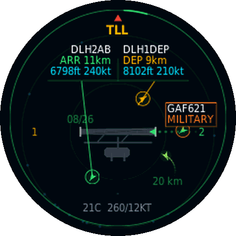
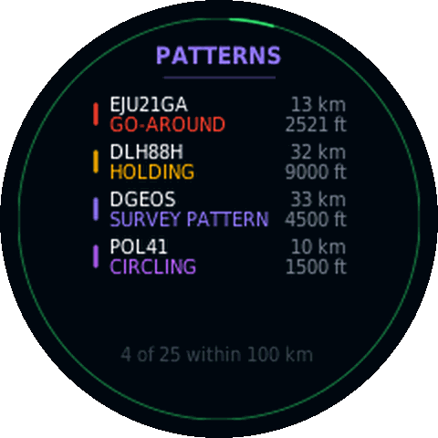

# Estonia presentation

This folder keeps the alternate regional presentation separate from the Munich-based main repository page.

- [Illustrated field guide](field_guide.html)
- [Real rendered screens](renders/)

The images are generated by the real display-page renderer. This folder contains presentation material only and no firmware or private configuration.

| Radar | Airport | Patterns |
|---|---|---|
|  |  |  |
